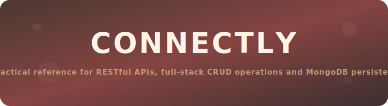
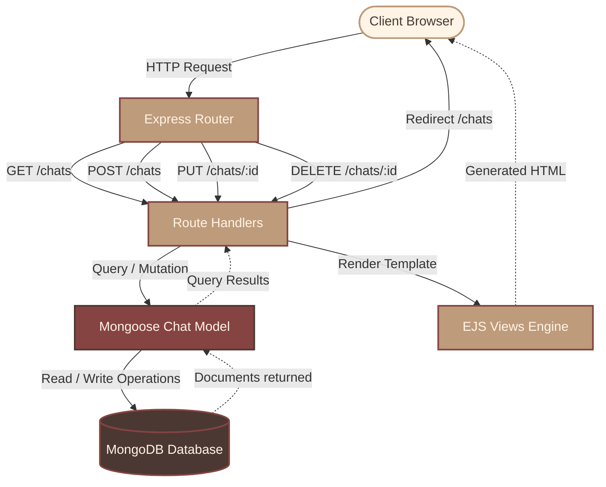

<p align="center">
  
</p>

## Overview

Connectly is a lightweight, server-side rendered messaging application built as a learning project to master backend API routing, database schema design, and document validations. Structuring the project around the Model-View-Controller (MVC) conceptual pattern, the server facilitates robust, stateful CRUD (Create, Read, Update, and Delete) operations on chat documents.

> [!NOTE]
> This repository serves as a code design template for configuring Express servers, writing modular schemas with Mongoose, configuring overrides for HTTP PUT/DELETE verbs from HTML form templates, and managing environment configurations securely.

---

## Tech Stack

The application relies on a solid, industry-standard stack for full-stack Node.js development:

| Component | Technology | Description |
| :--- | :--- | :--- |
| **Runtime Environment** | Node.js | Asynchronous event-driven JavaScript runtime. |
| **Web Server Framework** | Express.js | Core routing engine handling middleware pipeline and HTTP endpoints. |
| **Database Engine** | MongoDB | Document-based database for scalable JSON-like records. |
| **Object Data Mapper** | Mongoose | Strict schema validation, query generation, and document lifecycle control. |
| **View Template Engine** | EJS | Embeds server-side logic directly into HTML pages. |
| **Configuration Handler** | dotenv | Reads environment variables from untracked config files. |
| **Method Override** | method-override | Intercepts POST requests to route them as PUT and DELETE operations. |

---

## Architectural Workflow

The diagram below illustrates the path of a client request entering the system, executing database tasks, and returning a generated view to the user:



---

## API Documentation

Connectly utilizes RESTful endpoints to manage the lifecycle of a chat document:

| HTTP Method | URI Endpoint | Action Description | Database Operation | Response Method |
| :--- | :--- | :--- | :--- | :--- |
| **GET** | `/` | Root verification check | *No operation* | `res.send("root is working")` |
| **GET** | `/chats` | Fetch and view all messages | `Chat.find()` | `res.render("index.ejs")` |
| **GET** | `/chats/new` | Display new chat entry page | *No operation* | `res.render("new.ejs")` |
| **POST** | `/chats` | Write a new message | `new Chat().save()` | `res.redirect("/chats")` |
| **GET** | `/chats/:id/edit` | Display update form for a chat | `Chat.findById(id)` | `res.render("edit.ejs")` |
| **PUT** | `/chats/:id` | Update chat message content | `Chat.findByIdAndUpdate(id)` | `res.redirect("/chats")` |
| **DELETE** | `/chats/:id` | Remove a chat document | `Chat.findByIdAndDelete(id)` | `res.redirect("/chats")` |

---

## Schema Validation

Mongoose ensures that all incoming chat operations strictly adhere to validation rules before mutating database records:

```javascript
const chatSchema = new mongoose.Schema({
  from: {
    type: String,
    required: true,
  },
  to: {
    type: String,
    required: true,
  },
  msg: {
    type: String,
    maxLength: 500, // Enforces a 500-character upper bound limit
  },
  created_at: {
    type: Date,
    required: true,
  },
});
```

---

## Local Installation Guide

To run the application locally, follow these execution steps in your terminal:

### Prerequisites
Make sure you have MongoDB Community Server and Node.js installed locally.

### Step 1: Install Dependencies
Download required dependencies registered in the package.json file:
```bash
npm install
```

### Step 2: Establish Configurations
Create a local configuration file named `.env` in the root directory:
```env
PORT=8080
MONGO_URI=mongodb://127.0.0.1:27017/connectly
```

### Step 3: Seed Database
Initialize sample chats inside the MongoDB database:
```bash
node init.js
```

### Step 4: Launch Server
Start the local server instance:
```bash
npm start
```
The server will bind to the configured port and listen at `http://localhost:8080`.

---

## Technical Highlights

> [!TIP]
> **Method Overriding:** Since default HTML forms only support GET and POST methods, method-override intercepts the submission from the edit views and transforms standard POST operations into PUT and DELETE calls via the `?_method=PUT` query parameter.

> [!WARNING]
> **Command Buffering:** Mongoose has command buffering active by default. If your Express routes are queried before a database connection successfully establishes, Mongoose buffers queries in memory. This can cause routes like `/chats` to temporarily hang if the local MongoDB service is inactive.

---

<div align="center">

### Thank you for exploring this project.
If you found value in it, consider starring the repository.

---

Developed by **Ivy Singh**

*full-stack software engineering reference*

`ivysingh99@gmail.com`

<div style="margin-top: 15px;">
<a href="https://github.com/IvySingh-1" target="_blank" style="text-decoration: none; margin: 0 5px;">

</a>
<a href="https://www.linkedin.com/in/ivysingh99/" target="_blank" style="text-decoration: none; margin: 0 5px;">

</a>
<a href="https://x.com/ivysingh99" target="_blank" style="text-decoration: none; margin: 0 5px;">

</a>
</div>

</div>
